catatan:
1. Data masih fiktif, nanti coba di buat tidak fiktif sraping di internet
2. svg masih jelek
3. desain masih Jelek karena ngambil termpalte doang
4. integrasi mungkin nanti dockumennya di buatkan prd,brd,srs dan frs biar lebih jelas arah aplikasinya kemana dan bisa dikerjian dengan vibe koding ketika sudah di week atas, sekarang masih belum full vibe koding


tugas buat week 3 done!!!!!


AI usage:
Saya menggunakan AI untuk pembuatan SVG dan Pembuatan Dokumentasi, untuk kode saya mengejakan sendiri jadi untuk SVG dan Dokumentasi saya menggunakan AI untuk membantu saya mengejakannya, untuk primt yang saya gunaan di SVG adalah : "buatkan saya desain gamabrnya untuk uji coba aakah gambarnya sudah benar atau tidak, jangan gunakan nano banan untuk membuat gamenya gunakna svg saja agar lebih ringan" lalu utnuk dokumentasinya saya menggunakan primt "buatkan saya dokumenatsi berdasarkan project ini, bantu saya mendokumentasikan di dalam readme.md"

AI yang saya gunakan adalah Antigravity (Gemini) soalnya gratisan pak heheheh!!!!

# Bengkelin
Bengkelin adalah aplikasi web untuk memesan jadwal servis di bengkel motor, baik untuk motor konvensional (bensin) maupun motor listrik. Pengguna dapat mendaftarkan kendaraan, memilih bengkel dan layanan, menyimpan riwayat servis, dan mendapat pengingat servis berikutnya.

- **Nama Lengkap:** Thoriq
- **NIM:** 103022430006
- **Mata Kuliah:** Pemrograman Web Fullstack

## Tugas Pekan 3 - CSS Native

Pekan ini struktur HTML dari Pekan 2 diberi tampilan memakai **CSS native** (tanpa framework). Semua aturan gaya ada di satu file eksternal, `assets/css/style.css`, yang dihubungkan ke keempat halaman lewat:

```html
<link rel="stylesheet" href="assets/css/style.css">
```

Tidak ada tag `<style>` atau atribut `style` di HTML. Isi dan struktur semantic halaman tetap sama dengan Pekan 2; di HTML hanya ditambahkan atribut `class` serta beberapa `<div>` dan `<span>` sebagai pengelompok untuk styling.

### Penerapan CSS

| Ketentuan tugas | Penerapan di `style.css` |
| --- | --- |
| **Font properties** (`font-family`, `font-size`, `font-weight`) | Variabel `--font-teks` (Segoe UI/Helvetica/Arial) untuk isi dan `--font-judul` (Trebuchet MS) untuk judul. Skala ukuran konsisten di semua halaman: `h1` 2rem/700, `h2` 1.375rem/700, `h3` 1.0625rem/600, isi 16px/400. Label formulir dan menu memakai `font-weight: 600`. |
| **Styling list** (`ul`/`ol`) | Menu navigasi (`ul` jadi baris menu berbentuk pil), breadcrumb (`ol` dengan pemisah `/` dari `::before`), daftar pengingat servis (bullet kuning kustom), daftar layanan bengkel (chip), dan tips perawatan (warna `::marker`). |
| **Alignment teks** (`text-align`) | Judul halaman dan pengantar rata tengah; label formulir rata kanan di desktop dan rata kiri di mobile; label `<dt>` di halaman detail rata kanan; kolom biaya di tabel rata kanan, kolom jumlah dan nomor rata tengah; footer rata tengah. |
| **Warna background & teks** | Palet diambil dari logo dan disimpan sebagai variabel CSS di `:root`: biru `#1f6feb` (warna utama), kuning `#ffd33d` (aksen), abu gelap `#1f2937` (teks). Ada juga warna khusus jenis motor (oranye untuk konvensional, hijau untuk listrik) dan warna status (hijau "Selesai", kuning "Dijadwalkan"). |
| **`<div>` dan `<span>`** | `<div>`: `.container`, `.header-inner`, `.brand`, `.page-intro`, `.card-grid`, `.table-wrapper`, `.booking-layout`, `.info-grid`. `<span>`: `.tag` (jenis motor), `.badge` (status servis), `.required` (tanda wajib isi), `.radio-option`, `.code` (kode booking), `.label`, `.author`. |
| **Responsive** (`@media`) | Lihat bagian berikut. |

### Responsive dengan `@media` query

- **`max-width: 900px`**: halaman booking berubah dari dua kolom (ilustrasi + formulir) menjadi satu kolom.
- **`max-width: 768px`**: **navigasi berubah dari horizontal menjadi vertikal** (`flex-direction: column`), logo dan tagline ditumpuk di tengah, label formulir pindah ke atas input, kotak informasi di halaman detail menjadi satu kolom, dan kartu bengkel menjadi satu kolom.
- **`max-width: 480px`**: pasangan label-nilai `<dl>` ditumpuk, padding container dikecilkan.
- Tabel dibungkus `.table-wrapper` (`overflow-x: auto`) sehingga bisa digeser di layar sempit tanpa merusak tata letak.

```css
/* Mobile: navigasi berubah dari horizontal menjadi vertikal */
@media (max-width: 768px) {
  .main-nav ul {
    flex-direction: column;
  }
}
```

### Screenshot Pekan 3 (Desktop dan Mobile)

Desktop diambil pada lebar 1366px, mobile pada lebar 390px. Semua screenshot ada di `docs/screenshots/pekan-3/`.

#### 1. Beranda (`index.html`)

| Desktop | Mobile |
| --- | --- |
| 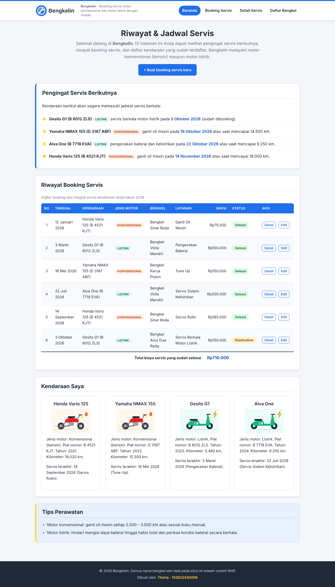 | 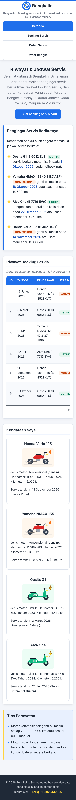 |

#### 2. Form Booking Servis (`booking.html`)

| Desktop | Mobile |
| --- | --- |
| 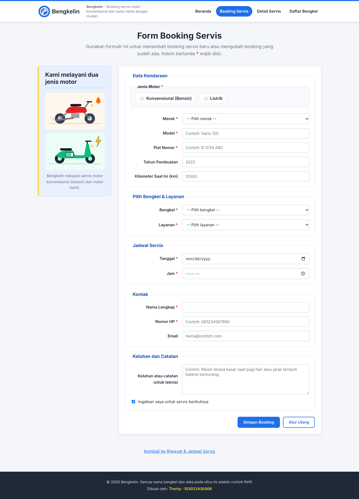 | 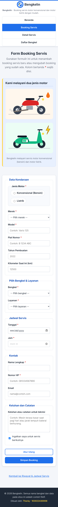 |

#### 3. Detail Servis (`detail.html`)

| Desktop | Mobile |
| --- | --- |
| 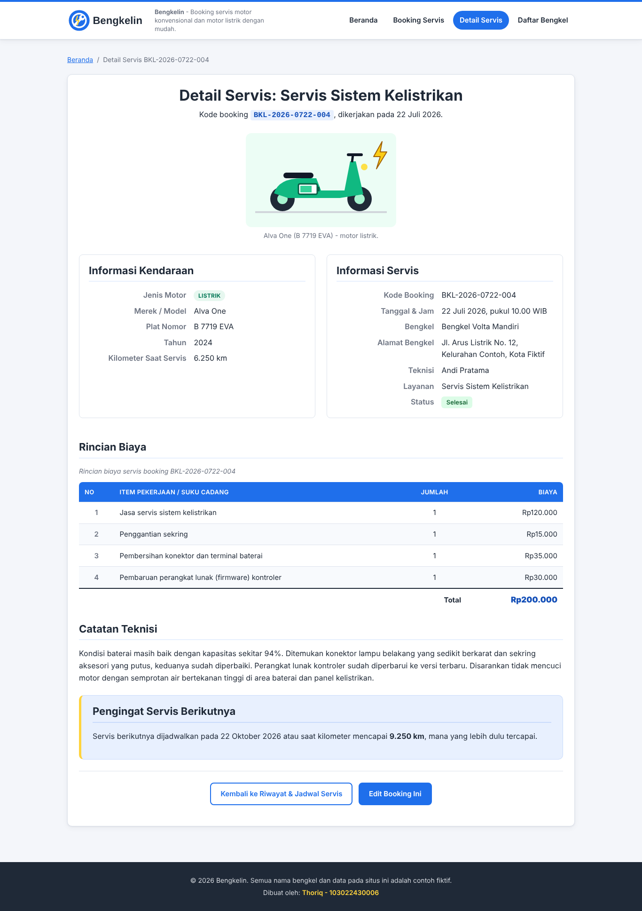 | 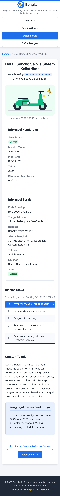 |

#### 4. Daftar Bengkel (`bengkel.html`)

| Desktop | Mobile |
| --- | --- |
| 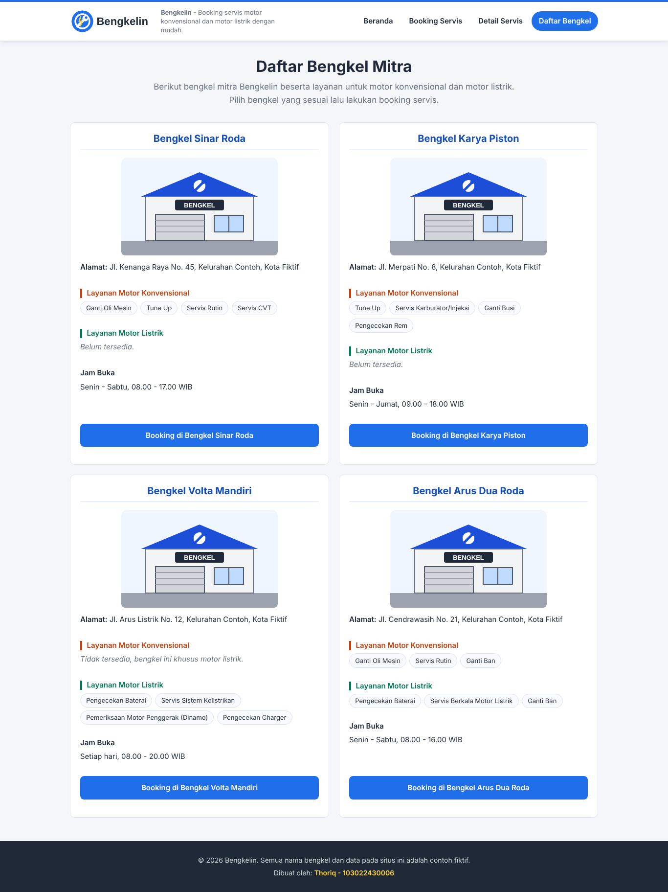 | 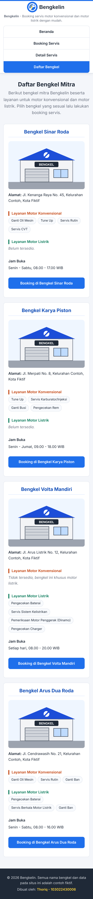 |

Validasi: semua halaman tetap lolos `html-validate` (preset `html-validate:recommended`) setelah penambahan class, `<div>`, dan `<span>`.

## Tugas Pekan 2 - Struktur HTML

Pada pekan ini proyek hanya berisi **struktur HTML murni** tanpa CSS (tidak ada tag `<style>`, atribut `style`, maupun framework) dan tanpa JavaScript. Fokus tugas:

1. Minimal 3 halaman dengan elemen dasar HTML (heading, paragraf, hyperlink, tabel, gambar, dan elemen formulir).
2. Penggunaan elemen semantic HTML5 sebagai pengganti `<div>` yang bertumpuk.
3. Aksesibilitas dasar: atribut `alt` pada setiap gambar dan `<label>` yang terhubung ke setiap input.
4. Screenshot setiap halaman dalam kondisi tanpa gaya (unstyled).

Semua data pada halaman (kendaraan, bengkel, harga, teknisi) adalah data contoh fiktif.

## Daftar Halaman

| File | Halaman | Fungsi |
| --- | --- | --- |
| `index.html` | Beranda - Riwayat & Jadwal Servis | Halaman utama: pengingat servis berikutnya, tabel riwayat booking servis (dengan tautan Detail dan Edit), daftar kendaraan saya, dan tips perawatan. |
| `booking.html` | Form Booking Servis | Formulir untuk menambah atau mengedit booking: data kendaraan, pilihan bengkel dan layanan, jadwal, kontak, keluhan, dan opsi pengingat servis. |
| `detail.html` | Detail Servis | Detail satu booking servis: informasi kendaraan, informasi servis, rincian biaya, catatan teknisi, dan pengingat servis berikutnya. |
| `bengkel.html` | Daftar Bengkel | Daftar bengkel mitra beserta alamat, layanan untuk motor konvensional dan motor listrik, serta jam buka. |

## Struktur Folder

```
bengkelin/
├── .gitignore
├── .htmlvalidate.json
├── README.md
├── index.html
├── booking.html
├── detail.html
├── bengkel.html
├── assets/
│   ├── css/
│   │   ├── .gitkeep
│   │   └── style.css
│   ├── images/
│   │   ├── bengkel.svg
│   │   ├── logo-bengkelin.svg
│   │   ├── motor-konvensional.svg
│   │   └── motor-listrik.svg
│   └── js/
│       └── .gitkeep
└── docs/
    └── screenshots/
        ├── 01-beranda.png
        ├── 02-booking.png
        ├── 03-detail.png
        ├── 04-daftar-bengkel.png
        └── pekan-3/            # screenshot desktop & mobile (Pekan 3)
```

Folder `assets/css/` berisi stylesheet Pekan 3; folder `assets/js/` masih kosong untuk pekan berikutnya. File `.htmlvalidate.json` adalah konfigurasi kecil untuk validator HTML (`html-validate`).

## Penerapan Semantic HTML5

- `<header>`: kepala halaman di setiap halaman (logo, nama situs, navigasi) dan kepala `<article>` pada halaman detail.
- `<nav>`: navigasi utama di setiap halaman, ditambah navigasi breadcrumb pada `detail.html`. Setiap `<nav>` diberi `aria-label` yang berbeda.
- `<main>`: konten utama setiap halaman (satu `<main>` per halaman).
- `<section>`: pengelompokan konten bertema, misalnya "Pengingat Servis Berikutnya", "Riwayat Booking Servis", "Kendaraan Saya", "Rincian Biaya", dan "Catatan Teknisi".
- `<article>`: konten yang berdiri sendiri, yaitu setiap kendaraan pada "Kendaraan Saya", detail satu booking servis, dan setiap bengkel pada `bengkel.html`.
- `<aside>`: konten pendukung, yaitu "Tips Perawatan" di beranda dan ilustrasi jenis motor di halaman booking.
- `<footer>`: kaki halaman berisi hak cipta dan identitas pembuat, serta kaki `<article>` berisi tautan kembali dan edit.
- `<figure>` dan `<figcaption>`: ilustrasi motor beserta keterangannya.
- `<time datetime="...">`: semua tanggal dan jam agar dapat dibaca mesin.
- `<dl>`, `<dt>`, `<dd>`: pasangan label dan nilai pada informasi kendaraan dan informasi servis.
- `<table>` dengan `<thead>`, `<tbody>`, `<tfoot>`: data tabular riwayat servis dan rincian biaya (total di `<tfoot>`).
- `<form>`, `<fieldset>`, `<legend>`: pengelompokan isian formulir booking.

## Penerapan Aksesibilitas

- `<html lang="id">` di setiap halaman agar pembaca layar menggunakan pelafalan Bahasa Indonesia.
- Setiap `` memiliki `alt` deskriptif dalam Bahasa Indonesia serta atribut `width` dan `height`.
- Setiap `<input>`, `<select>`, dan `<textarea>` memiliki `id` unik dan tepat satu `<label for="...">` yang cocok.
- Tombol radio "Jenis Motor" dikelompokkan dalam `<fieldset>` dengan `<legend>`, dan setiap radio memiliki label sendiri.
- Bagian formulir dikelompokkan dengan `<fieldset>` dan `<legend>` (Data Kendaraan, Pilih Bengkel & Layanan, Jadwal Servis, Kontak, Keluhan dan Catatan).
- Pilihan layanan dikelompokkan dengan `<optgroup>` ("Motor Konvensional", "Motor Listrik", dan "Umum").
- Atribut `required`, `type` yang sesuai (`date`, `time`, `tel`, `email`, `number`), dan `autocomplete` pada data kontak.
- Tabel memiliki `<caption>` dan `<th scope="col">` / `<th scope="row">`.
- Tautan "Detail" dan "Edit" di tabel diberi `aria-label` yang menyebut nomor booking agar tidak ambigu.
- Tautan "Langsung ke konten utama" di awal halaman, `aria-current="page"` pada menu aktif, dan hierarki heading yang runtut (satu `<h1>` per halaman).

Validasi: semua halaman lolos `html-validate` (preset `html-validate:recommended`) dan W3C Nu HTML Checker tanpa error maupun peringatan.

## Screenshot Pekan 2

Screenshot halaman penuh dalam kondisi tanpa CSS (hasil Pekan 2).

### 1. Beranda - Riwayat & Jadwal Servis (`index.html`)

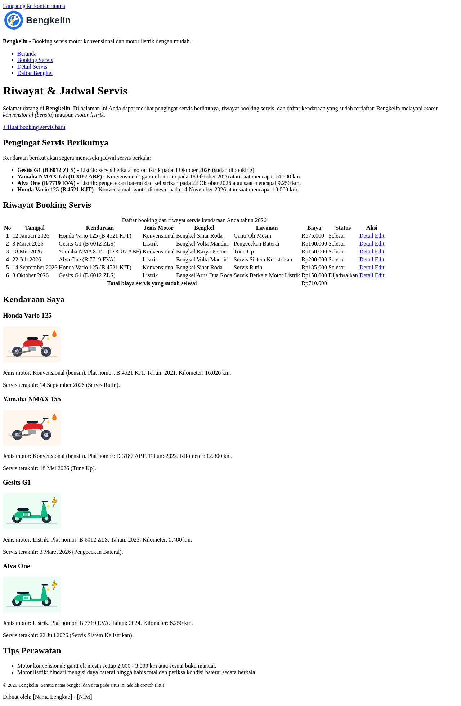

### 2. Form Booking Servis (`booking.html`)

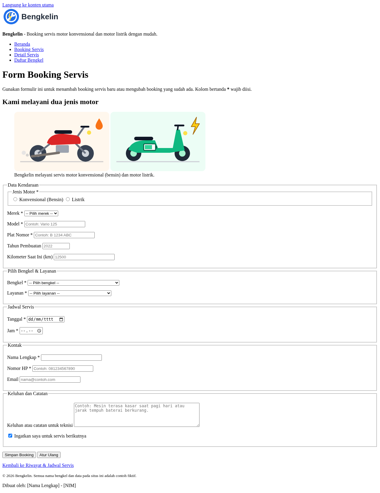

### 3. Detail Servis (`detail.html`)

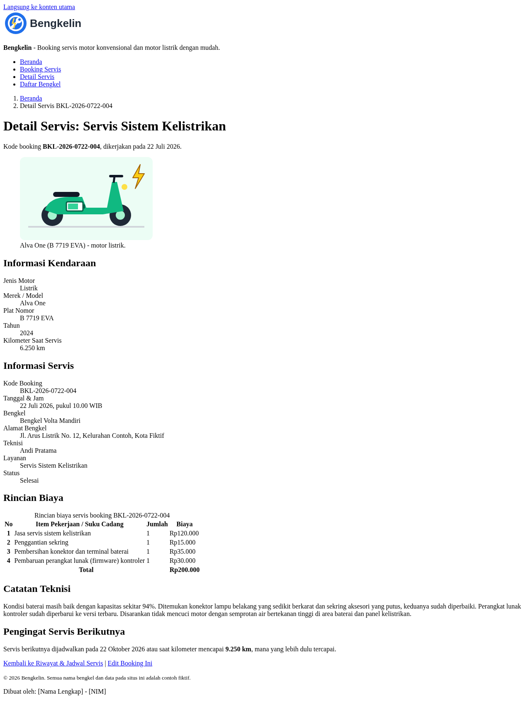

### 4. Daftar Bengkel (`bengkel.html`)

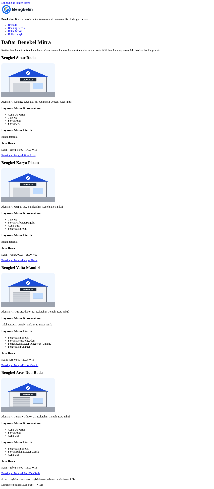

